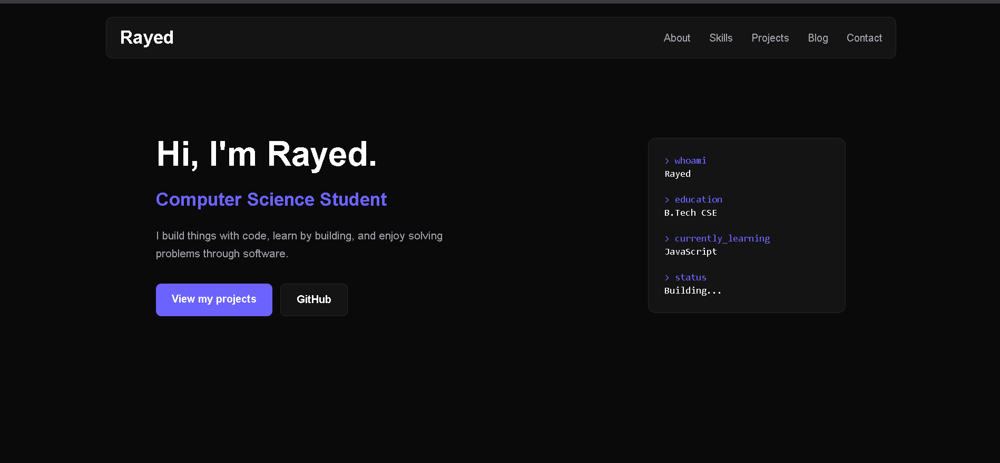

# Personal Portfolio

A responsive personal portfolio website built from scratch using HTML, CSS, and JavaScript.

The website showcases my projects, technical skills, learning journey, and ways to get in touch with me.

## 🌐 Live Website

**[View Portfolio](https://rayed2874.github.io/personal-portfolio/)**

---

## ✨ Features

- 🎨 Dark-themed responsive design
- 📱 Fully responsive layout for desktop and mobile
- 🧭 Fixed navigation bar with active section highlighting
- ☰ Responsive hamburger menu
- 👨‍💻 About Me section
- 🛠️ Skills organized by category
- 🚀 Project showcase with:
  - Project descriptions
  - Technologies used
  - GitHub links
  - Live demo links
- 🔎 Project filtering by category
- 📝 Blog section with individual article pages
- 📧 Contact section
- 📋 Copy email button using the Clipboard API
- ⚡ Smooth scrolling navigation
- 🎯 Reusable CSS components and CSS variables

---

## 🖥️ Preview

### Desktop



---

## 🛠️ Built With

### Frontend

- HTML5
- CSS3
- JavaScript

### Concepts Used

- Semantic HTML
- Flexbox
- CSS Grid
- Responsive Design
- CSS Custom Properties
- DOM Manipulation
- JavaScript Event Handling
- Array Methods
- Template Literals
- Clipboard API
- Dynamic Project Rendering

### Deployment

- GitHub Pages

---

## 📂 Project Structure

```text
personal-portfolio/
│
├── index.html
├── styles.css
├── script.js
│
├── assets/
│   └── images/
│       ├── flappy-penguin.png
│       ├── to-do-list.png
│       └── portfolio-preview.png
│
├── article.css
├── article.js
├── article.html
│
├── data.js
└── README.md
